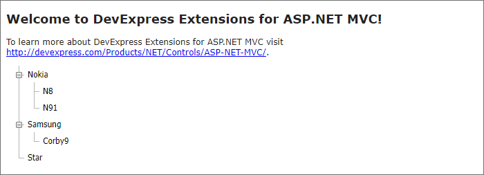

<!-- default badges list -->

<!-- default badges end -->
# TreeView for ASP.NET MVC - How to display data from a DataTable
This example demonstrates how to display data stored in a [DataTable](https://learn.microsoft.com/en-us/dotnet/api/system.data.datatable?view=net-7.0) in the [TreeView](https://docs.devexpress.com/AspNetMvc/DevExpress.Web.Mvc.TreeViewExtension) extension. The TreeView is in [unbound mode](https://docs.devexpress.com/AspNetMvc/10346/components/site-navigation-and-layout/tree-view/binding-to-data/unbound-mode), and the code example dynamically populates the extension with nodes.

## Files to Review

* [HomeController.cs](./CS/Controllers/HomeController.cs) (VB: [HomeController.vb](./VB/Controllers/HomeController.vb))
* [MyModel.cs](./CS/Models/MyModel.cs) (VB: [MyModel.vb](./VB/Models/MyModel.vb))
* [Index.cshtml](./CS/Views/Home/Index.cshtml)

## Documentation

* [Bind TreeView to Data](https://docs.devexpress.com/AspNetMvc/10331/components/site-navigation-and-layout/tree-view/binding-to-data)

## More Examples

* [TreeView for ASP.NET Forms - How to display data from a DataTable in unbound mode](https://github.com/DevExpress-Examples/how-to-bind-the-aspxtreeview-to-plain-data-unbound-mode-e2873)
* [TreeView for ASP.NET Forms - How to display data from a DataTable in virtual mode](https://github.com/DevExpress-Examples/how-to-bind-the-aspxtreeview-to-plain-data-virtual-mode-e2872)
* [TreeView for ASP.NET Forms - How to bind the control to an XpoDataSource](https://github.com/DevExpress-Examples/how-to-bind-the-aspxtreeview-with-associated-objects-or-the-xpohierarchicaldatasource-e2875)
